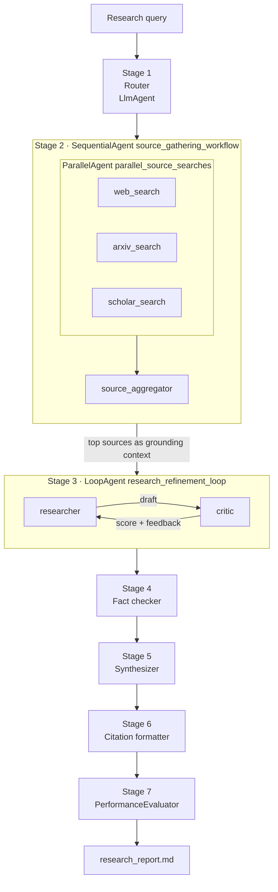
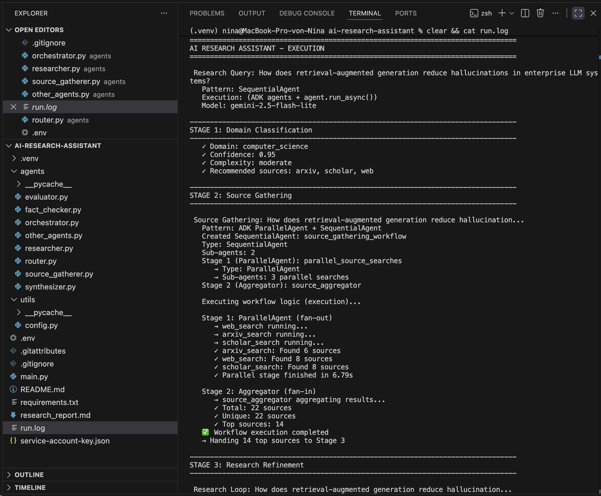
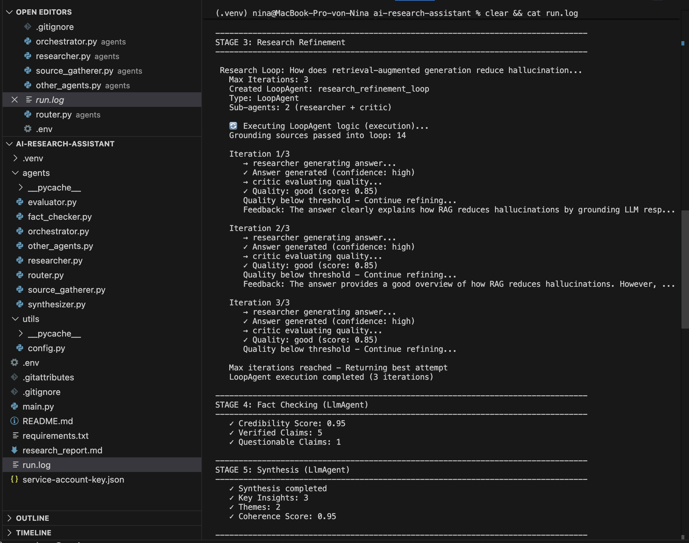
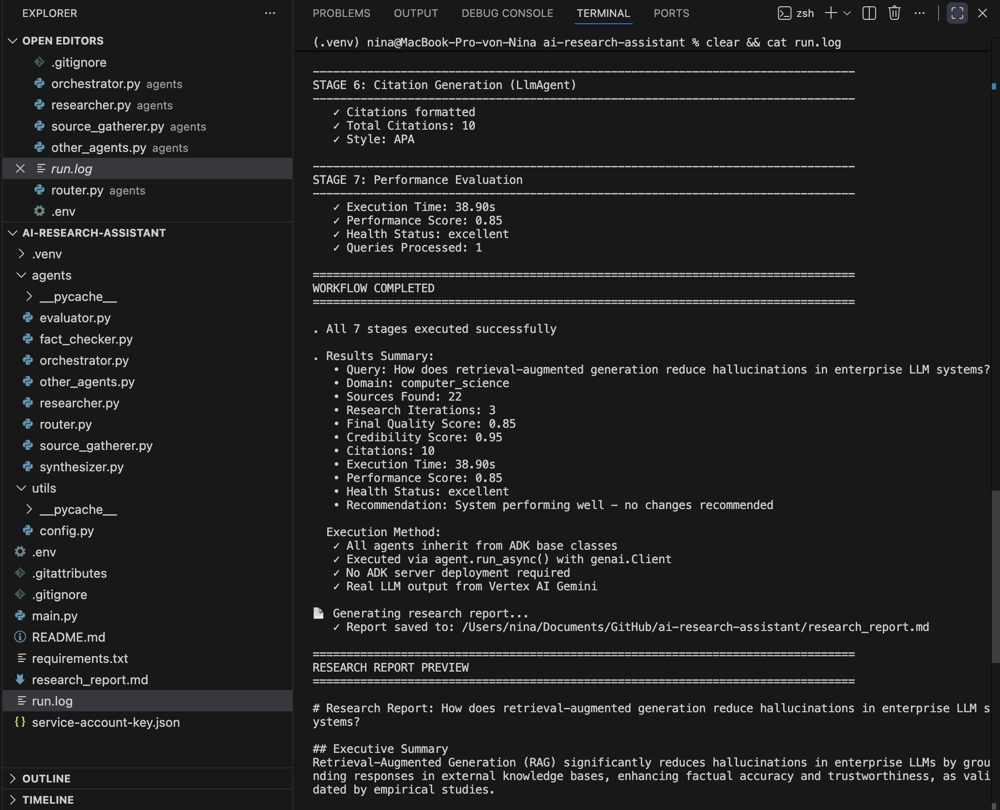

# DeepDive, an Agentic Research Assistant on Google ADK

Ask a language model a hard technical question and it answers in one pass. It drafts once, never checks its own work and invents sources when it runs out of facts. DeepDive splits that single call into a team of specialised agents built with Google's Agent Development Kit (ADK). One agent classifies the question. Three search agents gather sources at the same time. A researcher and a critic argue over the draft until it clears a quality bar. Then a fact checker, a synthesizer and a citation formatter turn the result into a report. An evaluator scores the whole run.

The final run answered *"How does retrieval-augmented generation reduce hallucinations in enterprise LLM systems?"* in 38.90 seconds. It gathered 22 sources, went through 3 researcher and critic cycles and produced a report with 10 APA citations.

---

## Architecture



Every box is an ADK agent object. The composition agents (`SequentialAgent`, `ParallelAgent`, `LoopAgent`) define the topology. Each `LlmAgent` holds its own instruction, temperature and JSON output config. At runtime the orchestrator walks that structure and calls Vertex AI Gemini through `genai.Client` with each agent's settings, so no ADK server deployment is needed.

| Stage | Agent | ADK pattern | Temperature | Output |
|---|---|---|---|---|
| 1 | `domain_classifier` | `LlmAgent` | 0.3 | domain, confidence, complexity |
| 2 | 3 search agents + `source_aggregator` | `ParallelAgent` inside `SequentialAgent` | 0.8 / 0.3 | ranked top sources |
| 3 | `researcher` + `critic` | `LoopAgent` | 0.7 / 0.3 | refined answer, score per iteration |
| 4 | `fact_checker` | `LlmAgent` | 0.3 | verified and questionable claims, credibility |
| 5 | `synthesizer` | `LlmAgent` | 0.7 | narrative, insights, themes |
| 6 | `citation_formatter` | `LlmAgent` | 0.1 | APA bibliography |
| 7 | `PerformanceEvaluator` | metrics | n/a | score, health status, bottlenecks |

---

## How each pattern works

### The router, a deterministic classifier

A physics question needs different sources than a history question, so the pipeline starts by classifying the query. `DomainClassifierAgent` in `agents/router.py` is an `LlmAgent` named `domain_classifier` with `temperature=0.3` and `response_mime_type="application/json"`. The low temperature matters here. A router that gives a different answer on every run breaks every stage downstream of it.

It worked. Across 4 runs of the same query the router returned `computer_science` with confidence 0.95 every time.

### Parallel source gathering, fan-out and fan-in

Searching web, arXiv and Google Scholar one after another wastes time, because none of the searches depends on the others. `agents/source_gatherer.py` builds a `ParallelAgent` named `parallel_source_searches` with `[web_search, arxiv_search, scholar_search]` as sub-agents. That is the fan-out. A `SequentialAgent` named `source_gathering_workflow` wraps it with the aggregator as the second step. That is the fan-in: the aggregator waits for all three result sets, removes duplicates, ranks by relevance and keeps the top 10 to 15.

The logs prove the concurrency. All three `running...` lines appear before the first `Found N sources` line. The whole parallel stage finished in 6.79 seconds.

### The refinement loop, generator and validator

A single draft misses things. `agents/researcher.py` pairs a `ResearcherAgent` (the generator) with a `ResearchCriticAgent` (the validator) inside a `LoopAgent` named `research_refinement_loop`. The order `[researcher, critic]` is fixed: the researcher writes, the critic scores from 0 to 1, lists strengths and weaknesses and returns feedback. That feedback goes back into the researcher's context for the next draft. `max_iterations=3` caps the cost if the critic never approves.

Two rules decide when the loop stops. The critic has to set `should_stop` and the score has to reach `QUALITY_THRESHOLD = 0.90`. On top of that, `MIN_ITERATIONS = 2` guarantees every first draft gets at least one round of feedback.

### Orchestration and data flow

`agents/orchestrator.py` runs the seven stages in order and awaits the two async stages. The step that makes the system agentic sits between Stage 2 and Stage 3. The top sources from the aggregator go into `execute_research_loop` and seed the researcher's context before the first draft. The researcher is told to ground its answer in those sources and name them. The critic sees which sources the draft cites and scores accordingly. Without this hand-off the researcher would answer from model memory and the gathered sources would only decorate the bibliography.

### Performance monitoring

Stage 7 measures total execution time, creates a `PerformanceEvaluator` and records quality score, sources found, iterations, fact checks and citations through `evaluate_query_result()`. `analyze_performance()` turns that into a performance score, a health status, bottlenecks and recommendations. The summary lands in `workflow_results` and prints at the end of the run.

---

## Running it

Requires Python 3.10 or newer and a Google Cloud project with the Vertex AI API enabled (listed as "Agent Platform API" in the console).

```bash
python3 -m venv .venv
source .venv/bin/activate
pip install -r requirements.txt
```

Create a service account with the role **Vertex AI User**, download its JSON file into the project folder and create `.env`:

```dotenv
GOOGLE_APPLICATION_CREDENTIALS=service-account-key.json
PROJECT_ID=your-gcp-project-id
LOCATION=us-central1
MODEL_NAME=gemini-2.5-flash-lite
```

`MODEL_NAME` has to be set. The starter default `gemini-2.0-flash` was shut down on Vertex AI on June 1, 2026 and returns a 404. `gemini-2.5-flash-lite` runs without thinking tokens by default, so the JSON outputs stay inside their token limits.

`.env` and the service account file are listed in `.gitignore` and never enter the repository.

Run with a custom query:

```bash
export RESEARCH_QUERY="How does retrieval-augmented generation reduce hallucinations in enterprise LLM systems?"
python main.py 2>&1 | tee run.log
```

The report is written to `research_report.md`.

---

## Custom query and final run

**Query:** How does retrieval-augmented generation reduce hallucinations in enterprise LLM systems?

I picked a topic from my own consulting work on RAG and agent systems. That made it possible to judge the output against what I know, which turned out to matter (see the fact-checking observation below).

| Metric | Result |
|---|---|
| Domain | computer_science, confidence 0.95, complexity moderate |
| Sources | 22 total (web 8, arXiv 6, Scholar 8), 14 top sources passed into the loop |
| Research iterations | 3, critic scores 0.85 / 0.85 / 0.85, max iterations reached |
| Fact check | credibility 0.95, 5 verified claims, 1 questionable |
| Synthesis | coherence 0.95, 3 insights, 2 themes |
| Citations | 10, APA |
| Execution time | 38.90 s |
| Performance | score 0.85, health status excellent |

---

## What the runs revealed

The system did not work well on the first try. Four runs of the same query exposed two failures the starter code hid. The fixes changed the output more than any prompt tweak.

| Run | Token limits | Critic | Sources | Iterations | Critic scores | Time |
|---|---|---|---|---|---|---|
| 1 | starter | starter | 0 | 1 | 0.95 | 16.43 s |
| 2 | starter | starter | 5 | 1 | 0.85 | 20.57 s |
| 3 | raised | starter | 23 | 1 | 0.95 | 28.61 s |
| 4 | raised | strict | 22 | 3 | 0.85 / 0.85 / 0.85 | 38.90 s |

### Sources failed silently

Run 1 found zero sources and printed no error. The search agents asked Gemini for up to 10 results with snippets or abstracts, but the starter capped each response at 1024 tokens. The JSON was cut off mid-object, `json.loads` failed and the fallback returned an empty result list. The pipeline carried on and produced a confident report with an empty bibliography.

Raising the limits to 4096 tokens per search and 8192 for the aggregator brought the count to 23 sources in run 3. A failed parse now prints the model's finish reason, so a truncation shows up as `MAX_TOKENS` in the log instead of a quiet zero.

The lesson reaches beyond this project. In an agent pipeline a parsing fallback that returns "empty" looks exactly like "nothing found". Every fallback needs a log line.

### The critic approved too easily

With the starter prompt the critic scored first drafts at 0.95 or 0.85. The stop rule sat at 0.80, so the loop ended after one iteration every time. A validator that approves everything turns the generator-validator pattern into one expensive call.

The critic now needs all of these for 0.90 or higher: at least 3 named sources, concrete evidence such as numbers or named methods, a discussion of limitations and no filler. The loop stops only at 0.90. Run 4 scored the first draft 0.85 on its own merits, so the `MIN_ITERATIONS` safeguard never had to step in. Two extra refinement rounds cost 10.3 seconds compared to run 3.

### The loop plateaued

The researcher revised the answer twice, yet all three drafts scored exactly 0.85. The feedback was specific but the revisions did not close the gap. Two causes stand out. The researcher receives the critic's full JSON as conversation history, which buries the actionable weaknesses among scores and reasoning. And generator and critic run on the same small model, so the researcher lacks the knowledge the critic asks for. A next version would pass the `weaknesses` list as an explicit checklist and run the critic on a stronger model than the generator.

### The fact checker verified a fabricated study

This is the most instructive result of the project. The search agents are simulated: Gemini generates plausible titles, authors and URLs instead of querying real APIs. The researcher then cited one of those invented papers, `arXiv:2401.09876`, as empirical evidence. The fact checker marked the claim "empirical studies demonstrate significant improvements" as **verified** and still returned a credibility score of 0.95. It only flagged the version that named the arXiv ID.

The fact checker compares claims against model knowledge. It never looks a source up. A credibility of 0.95 therefore measures internal consistency. Nobody checked a single citation. The bibliography shows the same weakness from another angle: the citation agent filled missing metadata with placeholders such as `Author, A. A. (Year)`, because the simulated results carried no authors or dates.

For a production system both stages need real retrieval, meaning actual arXiv and Scholar APIs for the searches and a URL or DOI lookup for the fact checker. Without that the pipeline is a well-structured way to make hallucinations look sourced, which is the exact problem the research query asks about.

### The metrics reward a lenient critic

The performance score fell from 0.95 in run 3 to 0.85 in run 4, although run 4 had a stricter review and two more revision rounds. The evaluator takes the critic's last score as quality, so a harsher critic lowers the metric even when the answer improves. Both runs still counted as "excellent". A useful quality metric needs a signal the critic does not control, for example the share of claims tied to a retrievable source.

---

## Changes beyond the TODOs

All TODOs in `researcher.py`, `source_gatherer.py`, `router.py` and `orchestrator.py` are implemented. These changes go further:

| Change | File | Why |
|---|---|---|
| Orchestrator imports `DomainClassifierAgent` from `router.py`, which got a `classify()` method | `orchestrator.py`, `router.py` | The starter imported the classifier from `other_agents.py`, so the router TODO never ran |
| Stage 2 sources seed the research loop | `researcher.py`, `orchestrator.py` | The researcher answered from memory and ignored the gathered sources |
| Searches run through `asyncio.to_thread` | `source_gatherer.py` | `asyncio.gather` over blocking calls executed them one after another |
| Higher `max_output_tokens` for searches, aggregator, researcher, critic, fact check, synthesis and citations | `source_gatherer.py`, `researcher.py`, `other_agents.py` | Truncated JSON produced silent empty results |
| Finish reason logged on parse failures | `source_gatherer.py` | Makes truncation visible |
| Stricter critic, `QUALITY_THRESHOLD = 0.90`, `MIN_ITERATIONS = 2` | `researcher.py` | The loop stopped after one iteration in every run |
| WORKFLOW COMPLETED summary prints after Stage 7 with performance metrics | `orchestrator.py` | The starter printed "All 7 stages" before Stage 7 had run |

One inherited detail to know: the console line `Executed via agent.run_async()` comes from the starter. The calls actually go through `genai.Client.models.generate_content` with each agent's instruction and config.

---

## Repository layout

```
agents/
  router.py            Stage 1  domain classifier (LlmAgent)
  source_gatherer.py   Stage 2  ParallelAgent + SequentialAgent
  researcher.py        Stage 3  LoopAgent with researcher and critic
  other_agents.py      Stages 4-6  fact checker, synthesizer, citation formatter
  orchestrator.py      runs all 7 stages, builds the report
  evaluator.py         Stage 7  PerformanceEvaluator
utils/config.py        environment settings
main.py                entry point
research_report.md     report from the final run
screenshots/           console output of the final run
```

---

## Screenshots

**Initialization.** Router classification, `SequentialAgent` and `ParallelAgent` creation, all three searches starting before the aggregator.



**Research loop.** `LoopAgent` creation and three researcher and critic iterations with scores and feedback.



**Completion.** Performance evaluation and the WORKFLOW COMPLETED summary.

